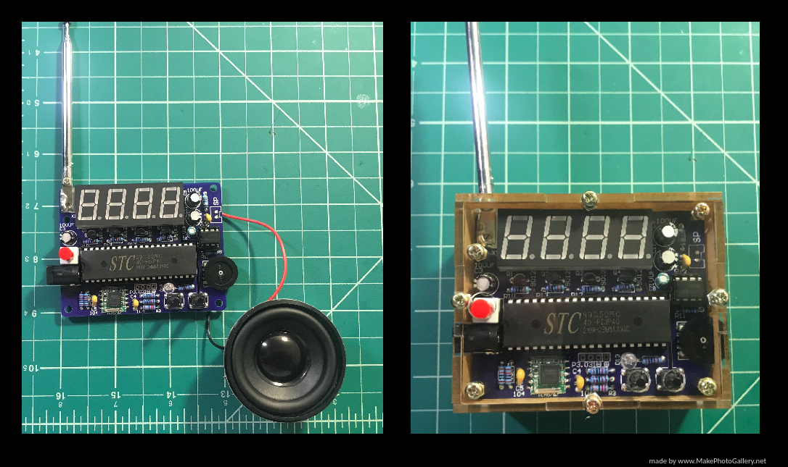

# DIY-Radio-Soldering-Kit

<h2>Tools</h2>
<ul>
  <li>Soldering Iron</li>
  <li>Solder</li>
</ul>  

<h2>Motivation for the Project</h2>
Hi there, today my <a href="https://www.amazon.com/MiOYOOW-Soldering-Adjustable-87-108MHz-Education/dp/B08RXQDNL6/ref=sr_1_5?dchild=1&keywords=diy+radio+kit&qid=1628030975&sr=8-5">DIY Radio kit</a> came from Amazon, so I decided to build it as soon as I got home. It took me roughly four hours due to the assembly, which came with no instructions, so thankfully my intuition helped me put it together. Moreover, I faced difficulty soldering the volume adjuster and power supply input since the volume adjuster required making a bridge from the radio PCB to the metal tip of the volume adjuster. The power supply challenged me in soldering its long tips since I needed to get enough solder for a connection, while being cautious to not add more solder than necessary. In the end, a got functioning FM radio that is a joy to share with family and friends, particularly my grandma who still an avid listener of the radio, and although the speaker is not the largest it gets the job done.

